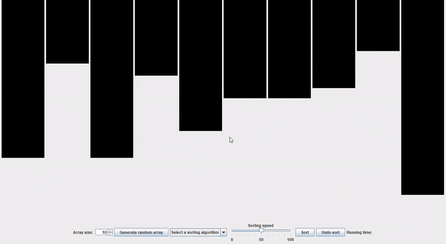

# Sorting Algorithm Visualiser

Sorting algorithm visualisations using Java and Swing

## What is this?

This application visualises various sorting algorithms. The algorithms currently visualised are:

* [Bubblesort](https://en.wikipedia.org/wiki/Bubble_sort)
* [Insertion sort](https://en.wikipedia.org/wiki/Insertion_sort)
* [Merge sort](https://en.wikipedia.org/wiki/Merge_sort)
* [timsort](https://en.wikipedia.org/wiki/Timsort)

The aim of this visualiser is to help users better understand how each algorithm works, by enabling them to view its steps in detail.

## How does it work?

To run the application, you need the [Java Runtime Environment](https://java.com/en/download/win10.jsp) installed on your machine.

The quickest way to run it is to download and run the [jar file](release/SortingAlgoVisualiser.jar). Alternatively, you can fork the project and build and run the code from your favourite IDE or shell. 

The application visualises the sorting of random integer arrays, with a default size of 10. You can generate a new array containing between 2 and 200 elements. Select a sorting algorithm from the drop-down list, set the sorting speed and then click 'Sort'. You can adjust the sorting speed as the algorithm runs and you can undo the sort when it has finished. 

Once the array has been sorted, the running time will be displayed. This is an indicative measure that helps compare the efficiency of the algorithms. For formal running time and efficiency analyses, see:

* [_Introduction to Algorithms_](https://mitpress.mit.edu/books/introduction-algorithms-third-edition) (chapter 2 for Insertion sort and chapter 4 for Merge sort).
* [Tim Peters' description of timsort](https://svn.python.org/projects/python/trunk/Objects/listsort.txt).
  
### Animation  

## How can I contribute?

Contributions are welcome! To contribute, please follow the process below:

* Create a personal fork of this GitHub repo.
* In your fork, create a branch off the **master** branch.
* Make and commit your changes to your branch, keeping the following in mind:
    * Follow the current coding style.
    * Include tests when adding a new feature or sorting algorithm visualisation.
* Build the repo with your changes, and ensure that the tests pass and the visualisations run correctly.
* Create a pull request (PR) against the repo's **master** branch.
* Wait for feedback or approval of your changes.
* When your changes have been approved, the PR will be merged.

# License

The project is licensed under the [MIT license](LICENSE.txt).